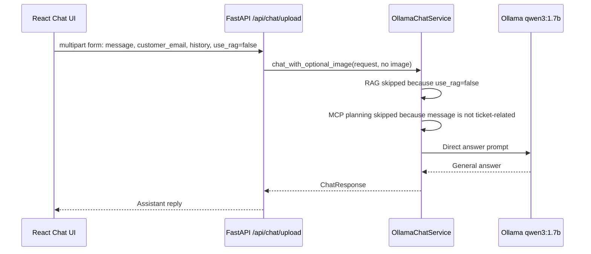

# Business Flow 1: General Chat

Example user message:

```text
Where is Egypt?
```

RAG toggle:

```text
Use manual = false
```

Business goal:

The user is asking a normal world-knowledge question. No ticket, no image, no
MCP tool, and no vector DB retrieval are required.

## Component Sequence



## Frontend Trace

File:

```text
aster-pump-aftercare-frontend/src/main.tsx
```

Important code:

```tsx
const formData = new FormData();
formData.append("message", text || "Create a support ticket from the uploaded image.");
formData.append("customer_email", email.trim());
formData.append("history", JSON.stringify(history));
formData.append("use_rag", String(useRag));
```

Line-by-line:

- `new FormData()` creates a multipart request because the same chat endpoint
  can also upload an image.
- `message` is the user's text: `Where is Egypt?`.
- `customer_email` is sent with every request, but the backend only uses it for
  ticket-related requests.
- `history` sends recent chat history.
- `use_rag=false` tells the backend not to search the manual.

Important code:

```tsx
const response = await fetch("/api/chat/upload", {
  method: "POST",
  body: formData,
});
```

Line-by-line:

- The browser calls Nginx at `/api/chat/upload`.
- Nginx proxies the request to the backend container.
- No JSON content type is set because the browser sets multipart boundaries for
  `FormData`.

## Backend API Trace

File:

```text
aster-pump-aftercare-backend/app/api/routes.py
```

Important code:

```python
message: str = Form(...),
customer_email: str = Form(""),
history: str = Form("[]"),
use_rag: bool = Form(False),
photo: UploadFile | None = File(None),
```

Line-by-line:

- `message` receives `Where is Egypt?`.
- `customer_email` receives the page-level email.
- `history` receives the JSON string from the UI.
- `use_rag` receives `false`.
- `photo` is `None` for a normal chat question.

Important code:

```python
normalized_message = merge_customer_email_into_tool_message(
    message=message.strip(),
    customer_email=customer_email.strip(),
    has_image=bool(image_bytes),
)
```

Line-by-line:

- `message.strip()` removes accidental whitespace.
- `customer_email.strip()` cleans the page-level email.
- `has_image=False` because no file was uploaded.
- The helper will **not** append email because `Where is Egypt?` is not
  ticket-related.

Expected backend log:

```text
story.chat-upload | received chat request use_rag=False history_items=0 customer_email=customer@example.com message='Where is Egypt?' image_filename= image_bytes=0 image_content_type= history=[]
```

## LLM Agent Trace

File:

```text
aster-pump-aftercare-backend/app/model/chat_client.py
```

Important code:

```python
rag_result = rag_service.retrieve_context(request)
if image_bytes or self.tool_planner.message_may_need_tool(request.message):
    decision = await self.tool_planner.plan(request, has_image=bool(image_bytes))
else:
    decision = {
        "action": "answer",
        "answer": "",
        "reason": "No image or ticket-related wording, so no MCP tool planning is required.",
    }
```

Line-by-line:

- `retrieve_context` sees `use_rag=false` and returns no context.
- `image_bytes` is empty.
- `message_may_need_tool("Where is Egypt?")` returns false because the message
  does not mention tickets, status, request, or an error workflow.
- The backend skips the planner LLM call.
- The decision becomes a direct answer decision.

Expected logs:

```text
story.rag | skipped chat retrieval because use_rag=false question='Where is Egypt?'
story.llm-agent.planner | skipped MCP planning decision={'action': 'answer', 'answer': '', 'reason': 'No image or ticket-related wording, so no MCP tool planning is required.'}
```

Important code:

```python
messages = self.prompt_builder.build_direct_messages(request, rag_result.context)
reply = await self.ollama_client.chat(messages, temperature=0.2, num_predict=512)
```

Line-by-line:

- The backend builds a normal prompt with no RAG context and no MCP tool result.
- `OllamaClient.chat` sends the prompt to the local Ollama container.
- The model returns a normal answer.

## How The Backend Calls The LLM

Important code:

```python
payload: dict[str, Any] = {
    "model": settings.model_name,
    "stream": False,
    "think": False,
    "options": {
        "temperature": temperature,
        "num_predict": num_predict,
        "num_ctx": 4096,
    },
    "messages": messages,
}
```

Line-by-line:

- `model` is usually `qwen3:1.7b`.
- `stream=False` means the backend waits for one full response.
- `think=False` disables visible reasoning output.
- `temperature` controls answer randomness.
- `num_predict` limits output length.
- `messages` contains the system prompt and user question.

Expected logs:

```text
story.llm-agent.ollama | sending request url=http://aster-pump-aftercare-model:11434/api/chat model=qwen3:1.7b payload={...}
story.llm-agent.ollama | received raw_response={...} content='Egypt is a country in North Africa...'
story.llm-agent | completed direct answer reply='Egypt is a country in North Africa...'
story.chat-upload | completed chat request model=qwen3:1.7b used_rag=False sources=[] reply='Egypt is a country in North Africa...'
```

## MCP In This Flow

MCP is not used in this flow.

The backend intentionally skips MCP because this is not a ticket, image, or
status request.
