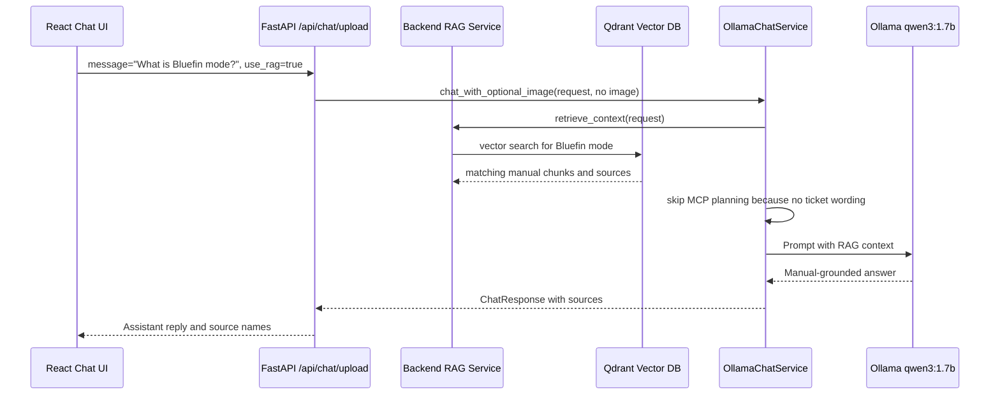

# Business Flow 2: RAG Manual Question

Example user message:

```text
What is Bluefin mode?
```

RAG toggle:

```text
Use manual = true
```

Business goal:

The user wants product-manual knowledge. The backend retrieves relevant manual
chunks from Qdrant, adds them to the model prompt, and asks Ollama to answer.

## Component Sequence



## Backend API Trace

The same `/api/chat/upload` route receives this request.

Important code:

```python
request = ChatRequest(message=normalized_message, history=chat_history, use_rag=use_rag)
```

Line-by-line:

- `normalized_message` remains `What is Bluefin mode?`.
- `history` is recent chat history.
- `use_rag=True` enables manual retrieval.

Expected API log:

```text
story.chat-upload | received chat request use_rag=True history_items=0 customer_email=customer@example.com message='What is Bluefin mode?' image_filename= image_bytes=0 image_content_type= history=[]
```

## RAG Trace

File:

```text
aster-pump-aftercare-backend/app/rag/service.py
```

Important behavior:

```python
rag_result = rag_service.retrieve_context(request)
```

Line-by-line:

- The chat service asks RAG for context.
- Because `request.use_rag=True`, the RAG service embeds the question.
- Qdrant searches for nearby manual chunks.
- The result contains `context` text and `sources`.

Expected logs:

```text
story.rag | retrieving chat context question='What is Bluefin mode?'
story.qdrant | searching collection=asterpump_x17_docs question='What is Bluefin mode?'
story.qdrant | search result sources=['asterpump_x17_operator_manual.txt', 'asterpump_x17_user_guide.pdf']
```

## LLM Agent Trace

Important code:

```python
rag_result = rag_service.retrieve_context(request)
if image_bytes or self.tool_planner.message_may_need_tool(request.message):
    decision = await self.tool_planner.plan(request, has_image=bool(image_bytes))
else:
    decision = {
        "action": "answer",
        "answer": "",
        "reason": "No image or ticket-related wording, so no MCP tool planning is required.",
    }
```

Line-by-line:

- RAG returns manual context.
- There is no image.
- The message does not look like a ticket or status request.
- MCP planning is skipped.
- This saves time and avoids unnecessary tool decisions.

Expected log:

```text
story.llm-agent.planner | skipped MCP planning decision={'action': 'answer', ...}
```

## Prompt With RAG Context

Important code:

```python
messages = self.prompt_builder.build_direct_messages(request, rag_result.context)
reply = await self.ollama_client.chat(messages, temperature=0.2, num_predict=512)
```

Line-by-line:

- `build_direct_messages` creates model messages.
- Because `rag_result.context` is not empty, the prompt includes a RAG system
  message.
- Ollama receives manual text about Bluefin mode.

Important prompt code:

```python
"Use this retrieved local context when relevant. "
"If the answer is in the context, prefer it over general knowledge.\n\n"
f"{rag_context}"
```

Line-by-line:

- The prompt tells the model to prefer local manual context.
- `rag_context` contains chunks from the fictional Aster manual.
- This is why the model can answer fictional product details.

Expected model logs:

```text
story.llm-agent.prompt | built direct messages=[{'role': 'system', ...}, {'role': 'system', 'content': 'Use this retrieved local context...Bluefin mode...'}, {'role': 'user', 'content': 'What is Bluefin mode?'}]
story.llm-agent.ollama | sending request url=http://aster-pump-aftercare-model:11434/api/chat model=qwen3:1.7b payload={...}
story.llm-agent.ollama | received raw_response={...} content='Bluefin mode is used for normal daytime cooling...'
story.chat-upload | completed chat request model=qwen3:1.7b used_rag=True sources=['asterpump_x17_operator_manual.txt', 'asterpump_x17_user_guide.pdf'] reply='Bluefin mode is used for normal daytime cooling...'
```

## MCP In This Flow

MCP is not used. RAG uses Qdrant directly from the backend, then Ollama answers.
