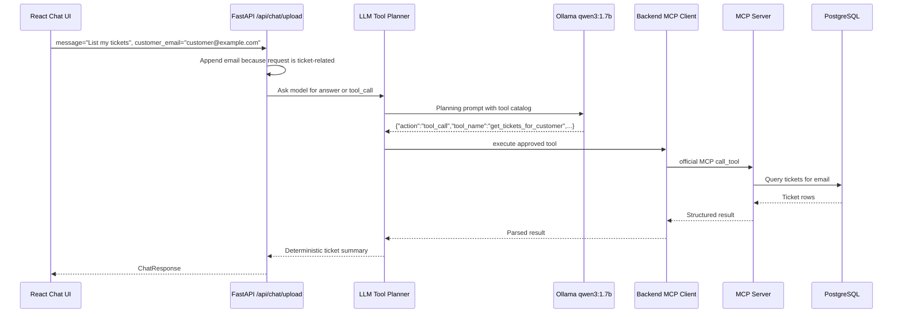

# Business Flow 3: Ticket Lookup

Example user messages:

```text
List my tickets
Get latest ticket status
```

Business goal:

The customer asks for ticket data. The chat text does not need to include the
email because the UI sends `customer_email` as a separate field. The backend
adds that email only for ticket-related requests, the LLM chooses an approved
MCP lookup tool, and the backend executes that tool.

## Component Sequence



## Email Injection Trace

File:

```text
aster-pump-aftercare-backend/app/api/routes.py
```

Important code:

```python
normalized_message = merge_customer_email_into_tool_message(
    message=message.strip(),
    customer_email=customer_email.strip(),
    has_image=bool(image_bytes),
)
```

Line-by-line:

- `message` might be only `List my tickets`.
- `customer_email` comes from the top UI email field.
- `has_image` is false in lookup flow.
- The helper detects ticket-related words and appends the email.

Important code:

```python
return f"{message}\nCustomer email: {customer_email}"
```

Line-by-line:

- The LLM planning message becomes:

```text
List my tickets
Customer email: customer@example.com
```

- This lets the LLM choose a ticket lookup MCP tool without forcing the user to
  type email in the chat box.

Expected log:

```text
story.chat-upload | received chat request use_rag=False history_items=0 customer_email=customer@example.com message='List my tickets\nCustomer email: customer@example.com' image_filename= image_bytes=0 image_content_type= history=[]
```

## LLM Tool Planner Prompt

File:

```text
aster-pump-aftercare-backend/app/model/chat_client.py
```

Important prompt code:

```python
"You are an LLM agent for Aster Pump Aftercare chat. "
"You can either answer directly or request one approved MCP tool. "
"Return JSON only. Do not use markdown. "
"Allowed actions: answer, tool_call. "
"Allowed tools: open_ticket_from_image, open_ticket_from_text, get_ticket, "
"get_latest_ticket_for_customer, get_tickets_for_customer. "
"If tool not found tell the user the tool is unavailable. "
"Never invent tools. If a required email or ticket id is missing, use action=answer and ask the user for it."
```

Line-by-line:

- The model is told it is an LLM agent.
- It can either answer or request one tool.
- It must return JSON only.
- It may only use approved tool names.
- It must not invent tools.
- If the email is missing, it must ask for it instead of guessing.

Important user prompt payload:

```python
{
    "user_message": request.message,
    "history": [{"role": item.role, "content": item.content} for item in request.history[-6:]],
    "use_rag": request.use_rag,
    "has_uploaded_image": has_image,
    "detected_email": detected_email,
    "detected_ticket_id": detected_ticket_id,
    "tool_catalog": self.TOOL_CATALOG,
    "tool_hint": tool_hint,
    "required_json_shape": {...},
}
```

Line-by-line:

- `user_message` contains the lookup text plus appended email.
- `history` gives the last few chat turns.
- `use_rag` is false for lookup.
- `has_uploaded_image` is false.
- `detected_email` is extracted from the appended email.
- `tool_catalog` lists the exact approved MCP tools.
- `tool_hint` nudges the tiny model toward the correct tool.
- `required_json_shape` tells the model the required response format.

Expected planner logs:

```text
story.llm-agent.planner | start planning message='List my tickets\nCustomer email: customer@example.com' tool_hint=Return tool_call get_tickets_for_customer with the detected customer_email.
story.llm-agent.ollama | sending request url=http://aster-pump-aftercare-model:11434/api/chat model=qwen3:1.7b payload={... "format": "json" ...}
story.llm-agent.ollama | received raw_response={...} content='{"action":"tool_call","tool_name":"get_tickets_for_customer","arguments":{"customer_email":"customer@example.com"}}'
story.llm-agent.planner | LLM returned decision={'action': 'tool_call', 'tool_name': 'get_tickets_for_customer', 'arguments': {'customer_email': 'customer@example.com'}}
story.llm-agent.planner | normalized decision={'action': 'tool_call', 'tool_name': 'get_tickets_for_customer', 'arguments': {'customer_email': 'customer@example.com'}, 'reason': ''}
```

## Backend Executes MCP

Important code:

```python
tool_result = await self.tool_executor.execute(decision["tool_name"], decision["arguments"])
```

Line-by-line:

- The backend has a validated decision.
- It calls `McpToolExecutor`.
- The LLM itself does not open the MCP session.

Important code:

```python
elif tool_name == "get_tickets_for_customer":
    result = await self.mcp_client.get_tickets_for_customer(str(arguments["customer_email"]))
```

Line-by-line:

- The executor maps the approved tool name to a Python method.
- The customer email is passed to the MCP client.

Expected backend logs:

```text
story.llm-agent.executor | executing MCP tool tool=get_tickets_for_customer arguments={'customer_email': 'customer@example.com'}
story.mcp-client | preparing get_tickets_for_customer email=customer@example.com
story.mcp-client | calling MCP tool=get_tickets_for_customer endpoint=http://aster-pump-aftercare-mcp-server:8200/mcp arguments={'customer_email': 'customer@example.com'}
story.mcp-client | initializing MCP session for tool=get_tickets_for_customer
story.mcp-client | MCP session initialized; sending tool request tool=get_tickets_for_customer
```

## MCP Server Tool

File:

```text
aster-pump-aftercare-mcp-server/app/main.py
```

Important code:

```python
@mcp.tool()
def get_tickets_for_customer(customer_email: str):
    logging.info("story.mcp.tool.get_tickets_for_customer | email=%s", customer_email)
    tickets = ticket_repository.list_tickets_for_email(customer_email)
    logging.info("story.mcp.tool.get_tickets_for_customer | count=%s result=%s", len(tickets), tickets)
    return {"tickets": tickets, "count": len(tickets), "customer_email": customer_email}
```

Line-by-line:

- `@mcp.tool()` exposes this function as an official MCP tool.
- The MCP server receives `customer_email`.
- The repository queries PostgreSQL.
- The tool logs the count and result.
- The tool returns structured JSON-like data to the backend MCP client.

Expected MCP logs:

```text
story.mcp.tool.get_tickets_for_customer | email=customer@example.com
story.mcp.tool.get_tickets_for_customer | count=3 result=[{...}, {...}, {...}]
```

## Final Chat Reply

Important code:

```python
reply = self.fallback_tool_reply(decision["tool_name"], tool_result)
```

Line-by-line:

- Ticket lookup replies are formatted deterministically.
- This avoids a slow second LLM call on the small CPU model.
- The LLM still decided the tool; backend formats the returned ticket data.

Expected final logs:

```text
story.llm-agent | completed ticket MCP tool with deterministic reply tool=get_tickets_for_customer arguments={'customer_email': 'customer@example.com'} reply='I found 3 ticket(s):\nTicket #3: status=completed, error=E-77, email_sent=yes...'
story.chat-upload | completed chat request model=qwen3:1.7b used_rag=False sources=[] reply='I found 3 ticket(s):...'
```

## Latest Ticket Difference

For `Get latest ticket status`, the LLM should choose:

```text
get_latest_ticket_for_customer
```

MCP server function:

```python
@mcp.tool()
def get_latest_ticket_for_customer(customer_email: str):
    ticket = ticket_repository.latest_ticket_for_email(customer_email)
    return ticket
```

The final reply is one line:

```text
Ticket #12: status=completed, error=E-77, email_sent=yes
```
