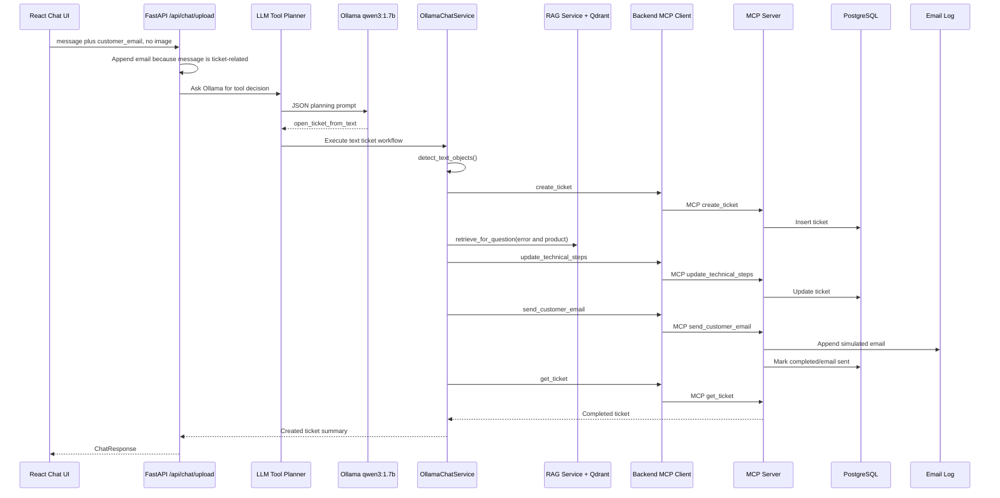

# Business Flow 4: Text Ticket Creation

Example user message:

```text
Create ticket. The display shows E-77 on my AsterPump X17.
```

Customer email field:

```text
email-field-test@example.com
```

Business goal:

The customer opens a support ticket using only typed text. The LLM chooses the
`open_ticket_from_text` workflow. The backend extracts `AsterPump X17` and
`E-77`, creates a ticket through MCP, retrieves troubleshooting steps from RAG,
updates the ticket, sends a simulated email, then returns the ticket number.

## Component Sequence



## API Trace

Expected API log:

```text
story.chat-upload | received chat request use_rag=True history_items=0 customer_email=email-field-test@example.com message='Create ticket. The display shows E-77 on my AsterPump X17.\nCustomer email: email-field-test@example.com' image_filename= image_bytes=0 image_content_type= history=[]
```

The important part is that the backend appended:

```text
Customer email: email-field-test@example.com
```

This happens only because the message is ticket-related.

## LLM Planning Trace

Important code:

```python
if image_bytes or self.tool_planner.message_may_need_tool(request.message):
    decision = await self.tool_planner.plan(request, has_image=bool(image_bytes))
```

Line-by-line:

- `image_bytes` is empty.
- `message_may_need_tool` returns true because the message contains `Create
  ticket`, `display`, and `E-77`.
- The backend calls the LLM planner.

Expected planner log:

```text
story.llm-agent.planner | start planning message='Create ticket. The display shows E-77 on my AsterPump X17.\nCustomer email: email-field-test@example.com' tool_hint=Return tool_call open_ticket_from_text with the detected customer_email.
```

Expected Ollama planning payload includes:

```json
{
  "user_message": "Create ticket. The display shows E-77 on my AsterPump X17.\nCustomer email: email-field-test@example.com",
  "has_uploaded_image": false,
  "detected_email": "email-field-test@example.com",
  "tool_catalog": {
    "open_ticket_from_text": {
      "description": "Create a ticket from the user text, add RAG troubleshooting steps, and send a reply email."
    }
  },
  "tool_hint": "Return tool_call open_ticket_from_text with the detected customer_email."
}
```

Expected LLM response:

```json
{
  "action": "tool_call",
  "tool_name": "open_ticket_from_text",
  "arguments": {
    "customer_email": "email-field-test@example.com"
  },
  "reason": "The user wants to create a ticket from typed error text."
}
```

## Text Object Extraction

Important code:

```python
detected_objects = self.detect_text_objects(request.message)
```

Line-by-line:

- The backend extracts labels from typed text.
- No image service is needed.

Important code:

```python
if "asterpump" in lowered or "x17" in lowered:
    objects.append("AsterPump X17")
for match in re.finditer(r"E-?(\d{2,3})(?!\d)", text, re.IGNORECASE):
    digits = re.sub(r"\D", "", match.group(0))
    code = f"E-{digits}"
    if code not in objects:
        objects.append(code)
```

Line-by-line:

- If text mentions `AsterPump` or `X17`, add product label.
- The regex finds error codes like `E-77` or `E77`.
- Non-digits are removed from the match.
- The code is normalized to `E-77`.
- Duplicate labels are ignored.

Expected result:

```python
["AsterPump X17", "E-77"]
```

## Create Ticket Through MCP

Important code:

```python
ticket = await self.tool_executor.mcp_client.create_ticket(
    customer_email=customer_email,
    description=description,
    detected_objects=detected_objects,
)
```

Line-by-line:

- The backend calls its MCP client.
- `customer_email` is the email from the UI.
- `description` is the chat request.
- `detected_objects` contains `AsterPump X17` and `E-77`.

Expected backend MCP logs:

```text
story.mcp-client | preparing create_ticket email=email-field-test@example.com description='Create ticket...' detected_objects=['AsterPump X17', 'E-77']
story.mcp-client | calling MCP tool=create_ticket endpoint=http://aster-pump-aftercare-mcp-server:8200/mcp arguments={'customer_email': 'email-field-test@example.com', 'description': 'Create ticket...', 'detected_objects': ['AsterPump X17', 'E-77']}
```

MCP server tool:

```python
@mcp.tool()
def create_ticket(customer_email: str, description: str, detected_objects: list) -> dict:
    ticket = ticket_repository.create_ticket(...)
    return ticket
```

Expected MCP logs:

```text
story.mcp.tool.create_ticket | inserting ticket email=email-field-test@example.com description='Create ticket...' detected_objects=['AsterPump X17', 'E-77']
story.mcp.tool.create_ticket | created ticket={'id': 15, 'customer_email': 'email-field-test@example.com', 'status': 'open', ...}
```

## RAG Troubleshooting Steps

Important code:

```python
question = (
    f"Provide after-purchase troubleshooting steps for {', '.join(detected_objects)}. "
    f"Customer description: {description}"
)
rag_result = rag_service.retrieve_for_question(question)
```

Line-by-line:

- The backend builds a RAG question from detected product/error labels.
- RAG searches the manual even if the UI RAG toggle is unrelated to ticket
  completion.
- The retrieved text becomes customer troubleshooting steps.

Expected logs:

```text
story.rag | retrieving agent context question='Provide after-purchase troubleshooting steps for AsterPump X17, E-77...'
story.qdrant | search result sources=['asterpump_x17_error_codes.txt', 'asterpump_x17_user_guide.pdf']
```

## Update Ticket And Send Email

Important code:

```python
ticket = await self.tool_executor.mcp_client.update_technical_steps(ticket["id"], technical_steps)
await self.tool_executor.mcp_client.send_customer_email(
    ticket_id=ticket["id"],
    to=customer_email,
    subject=subject,
    body=body,
)
completed = await self.tool_executor.mcp_client.get_ticket(ticket["id"])
```

Line-by-line:

- `update_technical_steps` stores RAG-based steps on the ticket.
- `send_customer_email` writes a simulated email and marks ticket completed.
- `get_ticket` reads the completed row back from PostgreSQL.

Expected logs:

```text
story.mcp.tool.update_technical_steps | updating ticket_id=15 technical_steps='Based on the product manual:\n- ...'
story.mcp.tool.send_customer_email | sending ticket_id=15 to=email-field-test@example.com subject='Support ticket #15 troubleshooting steps' body='Hello...'
story.mcp.tool.send_customer_email | sent ticket_id=15 log_path=/data/sent_emails.log
story.mcp.tool.get_ticket | ticket_id=15
story.mcp.tool.get_ticket | result={'id': 15, 'status': 'completed', 'email_sent': True, ...}
```

## Final Reply

Important code:

```python
return (
    f"Created ticket #{tool_result.get('id')} for {tool_result.get('customer_email')}. "
    f"Status={tool_result.get('status')}, error={tool_result.get('detected_error_code') or 'none'}, "
    f"email_sent={'yes' if tool_result.get('email_sent') else 'no'}."
)
```

Expected final logs:

```text
story.llm-agent | completed ticket MCP tool with deterministic reply tool=open_ticket_from_text arguments={'customer_email': 'email-field-test@example.com'} reply='Created ticket #15 for email-field-test@example.com. Status=completed, error=E-77, email_sent=yes.'
story.chat-upload | completed chat request model=qwen3:1.7b used_rag=True sources=['asterpump_x17_error_codes.txt', 'asterpump_x17_user_guide.pdf'] reply='Created ticket #15 for email-field-test@example.com. Status=completed, error=E-77, email_sent=yes.'
```
