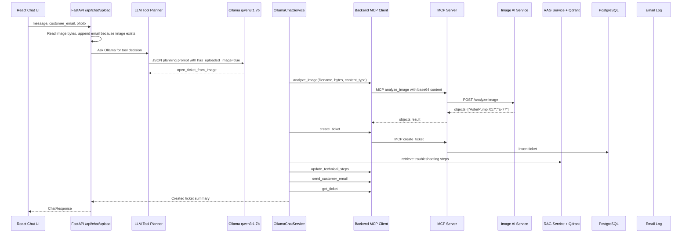

# Business Flow 5: Image Ticket Creation

Example user message:

```text
Create ticket
```

Customer email field:

```text
image-test@example.com
```

Uploaded image:

```text
aster-pump-aftercare-backend/docs/assets/test-images/asterpump_x17_e77_screen.png
```

Business goal:

The customer uploads a pump screen image. The LLM chooses
`open_ticket_from_image`. The backend sends the image to MCP, MCP calls the
Image AI service, the detected error code is used to create and complete a
ticket, RAG supplies troubleshooting steps, and a simulated email is sent.

## Component Sequence



## Frontend Upload Trace

Important code:

```tsx
if (photo) {
  formData.append("photo", photo);
}
```

Line-by-line:

- If the user selected a file, it is attached as multipart field `photo`.
- The browser sends raw file content to Nginx.
- Nginx forwards the multipart request to the backend.

Expected frontend-visible chat message:

```text
Create ticket

Attached image: asterpump_x17_e77_screen.png
```

## Backend API Image Trace

Important code:

```python
image_bytes = await photo.read() if photo is not None else b""
if photo is not None and not image_bytes:
    raise HTTPException(status_code=400, detail="Photo file is empty.")
```

Line-by-line:

- If `photo` exists, FastAPI reads its bytes.
- If the uploaded file is empty, the backend rejects the request.
- The code logs only image size and content type, not raw bytes.

Expected API log:

```text
story.chat-upload | received chat request use_rag=True history_items=0 customer_email=image-test@example.com message='Create ticket\nCustomer email: image-test@example.com' image_filename=asterpump_x17_e77_screen.png image_bytes=1680000 image_content_type=image/png history=[]
```

## LLM Planning Trace

Important planning payload fields:

```json
{
  "user_message": "Create ticket\nCustomer email: image-test@example.com",
  "has_uploaded_image": true,
  "detected_email": "image-test@example.com",
  "tool_hint": "The user uploaded an image. Return tool_call open_ticket_from_image with customer_email when available."
}
```

Line-by-line:

- `has_uploaded_image=true` tells the model that image analysis is possible.
- `detected_email` gives the required customer email.
- `tool_hint` nudges the tiny model to the image-ticket tool.

Expected planner logs:

```text
story.llm-agent.planner | start planning message='Create ticket\nCustomer email: image-test@example.com' tool_hint=The user uploaded an image. Return tool_call open_ticket_from_image with customer_email when available.
story.llm-agent.ollama | sending request url=http://aster-pump-aftercare-model:11434/api/chat model=qwen3:1.7b payload={... "format": "json" ...}
story.llm-agent.ollama | received raw_response={...} content='{"action":"tool_call","tool_name":"open_ticket_from_image","arguments":{"customer_email":"image-test@example.com"}}'
story.llm-agent.planner | normalized decision={'action': 'tool_call', 'tool_name': 'open_ticket_from_image', 'arguments': {'customer_email': 'image-test@example.com'}, 'reason': ''}
```

## Backend Calls MCP Analyze Image

Important code:

```python
detected_objects = await self.tool_executor.mcp_client.analyze_image(
    filename=image_filename,
    content=image_bytes,
    content_type=image_content_type,
)
```

Line-by-line:

- `image_filename` is the original upload name.
- `content` is raw image bytes.
- `content_type` is usually `image/png`.
- The backend calls MCP through `AftercareMcpClient`.

Important MCP client code:

```python
payload = await self.session_client.call_tool(
    "analyze_image",
    {
        "filename": filename,
        "content_base64": base64.b64encode(content).decode("ascii"),
        "content_type": content_type or "application/octet-stream",
    },
)
```

Line-by-line:

- MCP tool arguments must be JSON-compatible.
- Raw bytes are encoded as base64.
- `content_type` is passed to the MCP tool.
- The log hides the base64 content and only records its character count.

Expected backend MCP logs:

```text
story.mcp-client | preparing analyze_image filename=asterpump_x17_e77_screen.png image_bytes=1680000 content_type=image/png
story.mcp-client | calling MCP tool=analyze_image endpoint=http://aster-pump-aftercare-mcp-server:8200/mcp arguments={'filename': 'asterpump_x17_e77_screen.png', 'content_type': 'image/png', 'image_content_base64': '<omitted>', 'image_base64_characters': 2240000}
```

## MCP Server Analyze Image Tool

Important code:

```python
@mcp.tool()
async def analyze_image(filename: str, content_base64: str, content_type: str = "application/octet-stream") -> dict:
    content = base64.b64decode(content_base64)
    objects = await image_analyzer_tool.analyze(
        filename=filename or "uploaded-photo",
        content=content,
        content_type=content_type,
    )
    return {"objects": objects}
```

Line-by-line:

- `@mcp.tool()` exposes `analyze_image` over official MCP.
- The MCP server receives base64 content.
- It decodes base64 back into bytes.
- It calls the Image AI service wrapper.
- It returns detected objects.

Expected MCP logs:

```text
story.mcp.tool.analyze_image | received image filename=asterpump_x17_e77_screen.png image_bytes=1680000 content_type=image/png
story.mcp.tool.analyze_image | image service replied objects=['AsterPump X17', 'E-77']
```

## Image AI Service Trace

File:

```text
aster-pump-aftercare-image-ai-service/app/main.py
```

Important code:

```python
@app.post("/analyze-image")
async def analyze_image(file: UploadFile = File(...)) -> AnalyzeImageResponse:
    content = await file.read()
    uploaded_image = UploadedImage(filename=file.filename or "", content=content, content_type=file.content_type or "")
    objects = analyzer.analyze(uploaded_image)
    return AnalyzeImageResponse(objects=objects)
```

Line-by-line:

- The Image AI service receives the image from MCP.
- It reads bytes.
- It wraps the upload in an `UploadedImage` object.
- The analyzer detects product/error labels.
- It returns `objects`.

Expected Image AI logs:

```text
story.image-ai | received image filename=asterpump_x17_e77_screen.png image_bytes=1680000 content_type=image/png
story.image-ai.extractor | extracting searchable metadata filename=asterpump_x17_e77_screen.png image_bytes=1680000 max_bytes=200000
story.image-ai.analyzer | running detectors filename=asterpump_x17_e77_screen.png image_bytes=1680000 detector_count=2
story.image-ai.analyzer | detector=ProductDetector labels=['AsterPump X17']
story.image-ai.analyzer | detector=ErrorCodeDetector labels=['E-77']
story.image-ai.analyzer | final result=['AsterPump X17', 'E-77']
story.image-ai | detected objects=['AsterPump X17', 'E-77']
```

## Ticket Creation, RAG, Email

After image analysis returns objects, the flow becomes the same as text ticket
creation:

```python
return await self.create_ticket_and_reply(
    customer_email=customer_email,
    description=request.message,
    detected_objects=detected_objects,
)
```

Line-by-line:

- The detected objects from the image are passed to the common ticket workflow.
- MCP creates the ticket.
- RAG retrieves manual troubleshooting steps.
- MCP updates the ticket.
- MCP sends the simulated email.
- MCP returns the completed ticket.

Expected logs:

```text
story.mcp-client | analyze_image returned objects=['AsterPump X17', 'E-77']
story.mcp-client | preparing create_ticket email=image-test@example.com description='Create ticket...' detected_objects=['AsterPump X17', 'E-77']
story.rag | retrieving agent context question='Provide after-purchase troubleshooting steps for AsterPump X17, E-77...'
story.mcp-client | preparing update_technical_steps ticket_id=16 technical_steps='Based on the product manual:\n- ...'
story.mcp-client | preparing send_customer_email ticket_id=16 to=image-test@example.com subject='Support ticket #16 troubleshooting steps' body='Hello...'
story.mcp-client | preparing get_ticket ticket_id=16
```

## Final Reply

Expected final logs:

```text
story.llm-agent | completed ticket MCP tool with deterministic reply tool=open_ticket_from_image arguments={'customer_email': 'image-test@example.com'} reply='Created ticket #16 for image-test@example.com. Status=completed, error=E-77, email_sent=yes.'
story.chat-upload | completed chat request model=qwen3:1.7b used_rag=True sources=['asterpump_x17_user_guide.pdf', 'asterpump_x17_error_codes.txt'] reply='Created ticket #16 for image-test@example.com. Status=completed, error=E-77, email_sent=yes.'
```

## Why Image Bytes Are Not Printed

The backend and MCP client intentionally log image size and content type only:

```text
image_bytes=1680000
content_type=image/png
image_content_base64=<omitted>
```

This keeps logs readable and avoids dumping huge binary/base64 content.
