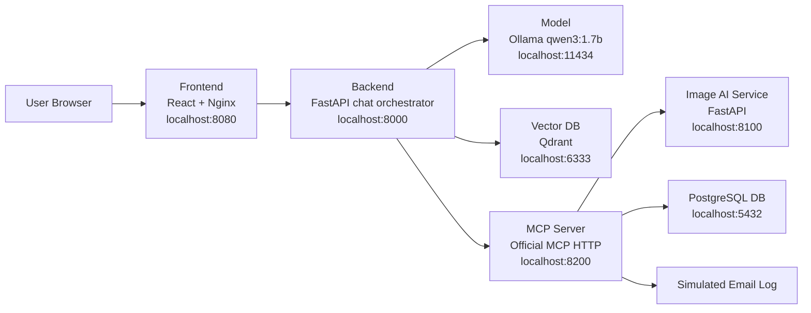

# Aster Pump Aftercare Build And Deployment Guide

This is the master build and deployment guide for the full local Docker Desktop
PoC.

Each component also has its own deployment guide. Use this root file first, then
jump into the component files when you need component-specific details.

## System Map



## Component Deployment Files

| Component | Guide |
| --- | --- |
| Frontend | `aster-pump-aftercare-frontend/BUILD_AND_DEPLOY.md` |
| Backend | `aster-pump-aftercare-backend/BUILD_AND_DEPLOY.md` |
| Model | `aster-pump-aftercare-model/BUILD_AND_DEPLOY.md` |
| Vector DB | `aster-pump-aftercare-vectordb/BUILD_AND_DEPLOY.md` |
| Database | `aster-pump-aftercare-db/BUILD_AND_DEPLOY.md` |
| Image AI Service | `aster-pump-aftercare-image-ai-service/BUILD_AND_DEPLOY.md` |
| MCP Server | `aster-pump-aftercare-mcp-server/BUILD_AND_DEPLOY.md` |

## Component Order

Build order:

1. Model
2. Vector DB
3. Database
4. Image AI Service
5. MCP Server
6. Backend
7. Frontend

Runtime dependency order:

1. Model, Vector DB, Database, Image AI Service
2. MCP Server
3. Backend
4. Frontend

Docker Compose handles runtime ordering through `depends_on`, but understanding
the order helps when troubleshooting.

## Ports

| Service | Port | Purpose |
| --- | --- | --- |
| Frontend | `8080` | Browser app |
| Backend | `8000` | FastAPI public API |
| Model | `11434` | Ollama API |
| Vector DB | `6333` | Qdrant API |
| Database | `5432` | PostgreSQL |
| Image AI Service | `8100` | Image analysis API |
| MCP Server | `8200` | MCP Streamable HTTP and health |

## Prerequisites

1. Docker Desktop installed.
2. Docker Desktop running with Linux containers.
3. PowerShell opened at:

```powershell
cd C:\ai-workspace\lama-local-llm\aster-pump
```

Verify Docker:

```powershell
docker info
```

If `Server` is missing, Docker Desktop is not fully running.

## Step 1: Create Persistent Volumes

The Compose file uses external volumes. Create them once:

```powershell
docker volume create aster-pump-aftercare-ollama
docker volume create aster-pump-aftercare-qdrant
docker volume create aster-pump-aftercare-postgres
```

What each volume stores:

| Volume | Used By | Stores |
| --- | --- | --- |
| `aster-pump-aftercare-ollama` | Model service | Downloaded Ollama model files |
| `aster-pump-aftercare-qdrant` | Vector DB | Qdrant vector storage |
| `aster-pump-aftercare-postgres` | DB | PostgreSQL ticket data |

## Step 2: Build All Local Images

```powershell
.\bin\build-all-images.ps1
```

This script enters each repo folder and runs its `build-image.ps1`.

It does not start containers.

Verify images:

```powershell
docker images | Select-String "aster-pump-aftercare"
```

Expected local images:

```text
aster-pump-aftercare-frontend
aster-pump-aftercare-backend
aster-pump-aftercare-model
aster-pump-aftercare-vectordb
aster-pump-aftercare-db
aster-pump-aftercare-image-ai-service
aster-pump-aftercare-mcp-server
```

## Step 3: Deploy Full Stack

```powershell
.\bin\deploy-stack.ps1
```

Equivalent direct command:

```powershell
docker compose up -d
```

First startup can take time because the model container downloads:

```text
qwen3:1.7b
```

The model is stored in the Ollama volume and should not download again after
normal restarts.

## Daily Start And Stop

After the first build and deployment, you usually do not need to rebuild images.
Use this section for normal local demo usage.

Start the full stack:

```powershell
cd C:\ai-workspace\lama-local-llm\aster-pump
.\bin\deploy-stack.ps1
```

Equivalent direct Docker command:

```powershell
docker compose up -d
```

Stop the full stack:

```powershell
.\bin\stop-stack.ps1
```

Equivalent direct Docker command:

```powershell
docker compose down
```

Check current status:

```powershell
docker compose ps
```

Watch all logs:

```powershell
docker compose logs -f
```

Watch only the demo story lines:

```powershell
docker compose logs -f | Select-String -Pattern "FRONTEND \||BACKEND \||MCP \||IMAGE-AI \||MODEL \|"
```

The story prefixes mean:

| Prefix | Meaning |
| --- | --- |
| `FRONTEND` | Nginx received a browser request or proxied an API call. |
| `BACKEND` | FastAPI received the chat request, asked the model for a tool decision, validated it, called RAG, MCP, or Ollama. |
| `MCP` | The official MCP server ran a tool such as image analysis, ticket insert, or email. |
| `IMAGE-AI` | The image analyzer inspected the uploaded file and returned detected labels. |
| `MODEL` | Ollama startup and local model readiness. |

Important behavior:

- `docker compose down` stops and removes containers.
- It does not delete the named volumes.
- The downloaded Ollama model, Qdrant RAG vectors, and PostgreSQL ticket data
  are kept.
- To erase local data, use the reset steps later in this guide.

## Step 4: Check Containers

```powershell
docker compose ps
```

Expected:

- all containers are `Up`
- health checked containers eventually become `healthy`

## Step 5: Verify Each Service

Frontend:

```powershell
curl.exe -I http://localhost:8080
```

Backend:

```powershell
curl.exe http://localhost:8000/api/health
```

Model:

```powershell
curl.exe http://localhost:11434/api/tags
```

Vector DB:

```powershell
curl.exe http://localhost:6333/collections
```

Image AI:

```powershell
curl.exe http://localhost:8100/health
```

MCP:

```powershell
curl.exe http://localhost:8200/health
```

Open UI:

```text
http://localhost:8080
```

## Step 6: Verify RAG Through Chat Upload

```powershell
curl.exe -X POST http://localhost:8080/api/chat/upload `
  -F "message=What does error code E-77 mean?" `
  -F "use_rag=true" `
  -F "history=[]"
```

Expected answer should mention:

```text
Coolant Loop Pressure Echo
```

Why this proves RAG:

- `E-77` and `Coolant Loop Pressure Echo` are fictional manual content.
- Backend loaded the PDF/text manuals.
- Qdrant returned matching chunks.
- The model answered using retrieved context.

## Step 7: Verify General Chat Without RAG

```powershell
curl.exe -X POST http://localhost:8080/api/chat/upload `
  -F "message=Where is Egypt?" `
  -F "use_rag=false" `
  -F "history=[]"
```

Expected answer should say that Egypt is in North Africa.

Why this matters:

- It proves the app is not only a support-ticket flow.
- The same chat endpoint can answer general questions when RAG is disabled.

## Step 8: Verify Chat-First MCP Tool Flow

Text-only ticket creation:

```powershell
curl.exe -X POST http://localhost:8080/api/chat/upload `
  -F "message=Create ticket for deployment-text-test@example.com. The display shows E-77 on my AsterPump X17." `
  -F "use_rag=true" `
  -F "history=[]"
```

Expected:

- LLM planner chooses `open_ticket_from_text`
- backend validates the tool call
- image analyzer is skipped
- MCP creates and completes the ticket
- ticket number is returned in chat
- detected error code is `E-77`
- email is marked sent

Image-plus-text ticket creation:

```powershell
curl.exe -X POST http://localhost:8080/api/chat/upload `
  -F "message=Create ticket for deployment-test@example.com" `
  -F "use_rag=true" `
  -F "history=[]" `
  -F "photo=@C:\ai-workspace\lama-local-llm\aster-pump\aster-pump-aftercare-backend\docs\assets\test-images\asterpump_x17_e77_screen.png"
```

Expected:

- LLM planner chooses `open_ticket_from_image`
- backend validates that an image exists
- MCP calls the Image AI service
- ticket number is returned in chat
- status is `completed`
- detected error code is `E-77`
- email is marked sent

What this tests:

1. Frontend Nginx proxy
2. Backend FastAPI chat upload endpoint
3. Ollama tool planner and backend tool validation
4. MCP tool calls
5. Image AI service when an image is present
6. PostgreSQL insert/update
7. Qdrant RAG retrieval
8. Simulated email tool

## Stop Stack

```powershell
.\bin\stop-stack.ps1
```

This stops containers but keeps volumes.

## Reset Local Data

Only do this when you want a clean local environment.

Stop stack:

```powershell
docker compose down
```

Delete volumes:

```powershell
docker volume rm aster-pump-aftercare-ollama
docker volume rm aster-pump-aftercare-qdrant
docker volume rm aster-pump-aftercare-postgres
```

Then recreate volumes and deploy again.

## Troubleshooting

### Docker API Pipe Error

Symptom:

```text
failed to connect to the docker API at npipe:////./pipe/dockerDesktopLinuxEngine
```

Fix:

1. Open Docker Desktop.
2. Wait until Docker says it is running.
3. Run `docker info` again.

### Model Is Slow Or Not Ready

Check:

```powershell
docker compose logs -f aster-pump-aftercare-model
```

First model pull can take a few minutes.

### Qdrant Has No Collection

Start or restart backend:

```powershell
docker compose up -d aster-pump-aftercare-backend
```

Backend builds the RAG collection on startup.

### Frontend Shows Old UI

Rebuild frontend:

```powershell
cd .\aster-pump-aftercare-frontend
.\build-image.ps1
cd ..
docker compose up -d aster-pump-aftercare-frontend
```

### Image Upload Returns HTTP 413

Check `aster-pump-aftercare-frontend/nginx.conf`.

The current setting is:

```nginx
client_max_body_size 10m;
```

Increase it if your test image is larger than 10 MB.
