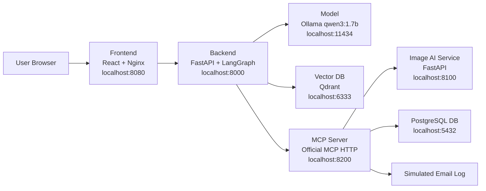

# Aster Pump Aftercare

Local Docker Desktop proof of concept for an after-purchase support system.

The system demonstrates:

- simple customer support UI
- chat UI for manual questions and general questions
- FastAPI backend
- LangGraph agent orchestration
- official MCP protocol tool server
- local CPU-only LLM through Ollama
- RAG with Qdrant
- PostgreSQL ticket storage
- small Image AI service

## System Map



## Repositories In This Workspace

| Folder | Component |
| --- | --- |
| `aster-pump-aftercare-frontend` | React UI served by Nginx |
| `aster-pump-aftercare-backend` | FastAPI, LangGraph, RAG, model client, MCP client |
| `aster-pump-aftercare-model` | Ollama model runtime with `qwen3:1.7b` |
| `aster-pump-aftercare-vectordb` | Qdrant vector database |
| `aster-pump-aftercare-db` | PostgreSQL ticket database |
| `aster-pump-aftercare-image-ai-service` | Small image/text analyzer |
| `aster-pump-aftercare-mcp-server` | Official MCP tool server |

## Main Guides

Start here:

```text
DEPLOYMENT_STEPS.md
```

Then read component-specific guides:

- `aster-pump-aftercare-frontend/README.md`
- `aster-pump-aftercare-backend/README.md`
- `aster-pump-aftercare-model/README.md`
- `aster-pump-aftercare-vectordb/README.md`
- `aster-pump-aftercare-db/README.md`
- `aster-pump-aftercare-image-ai-service/README.md`
- `aster-pump-aftercare-mcp-server/README.md`

Each repo also has:

```text
BUILD_AND_DEPLOY.md
```

## Operational Scripts

Scripts are kept in `bin`.

| Script | Function |
| --- | --- |
| `bin/build-all-images.ps1` | Builds all local Docker images. |
| `bin/deploy-stack.ps1` | Starts the Docker Compose stack. |
| `bin/stop-stack.ps1` | Stops the stack. |
| `bin/generate-user-guide.py` | Regenerates the fictional PDF manual. |
| `bin/generate-error-test-images.py` | Regenerates `E-41`, `E-77`, and `E-93` screen images. |

Script details are documented in:

```text
bin/README.md
```

## Quick Start

```powershell
cd C:\ai-workspace\lama-local-llm\aster-pump
docker volume create aster-pump-aftercare-ollama
docker volume create aster-pump-aftercare-qdrant
docker volume create aster-pump-aftercare-postgres
.\bin\build-all-images.ps1
.\bin\deploy-stack.ps1
```

Open:

```text
http://localhost:8080
```

Useful UI tests:

- With **Use Aster manual** checked, ask `What is Bluefin mode?`
- With **Use Aster manual** unchecked, ask `Where is Egypt?`
- Upload `asterpump_x17_e77_screen.png` to test the ticket workflow.

## Daily Start And Stop

Use these commands after the images and volumes already exist.

Start the full stack:

```powershell
cd C:\ai-workspace\lama-local-llm\aster-pump
.\bin\deploy-stack.ps1
```

Equivalent Docker command:

```powershell
docker compose up -d
```

Stop the full stack:

```powershell
.\bin\stop-stack.ps1
```

Equivalent Docker command:

```powershell
docker compose down
```

Check running containers:

```powershell
docker compose ps
```

Follow logs:

```powershell
docker compose logs -f
```

Follow the main demo story lines only:

```powershell
docker compose logs -f | Select-String -Pattern "FRONTEND \||BACKEND \||MCP \||IMAGE-AI \||MODEL \|"
```

Stopping the stack removes containers, but keeps the named Docker volumes. That
means the Ollama model files, Qdrant vectors, and PostgreSQL tickets stay on
your machine for the next start.
