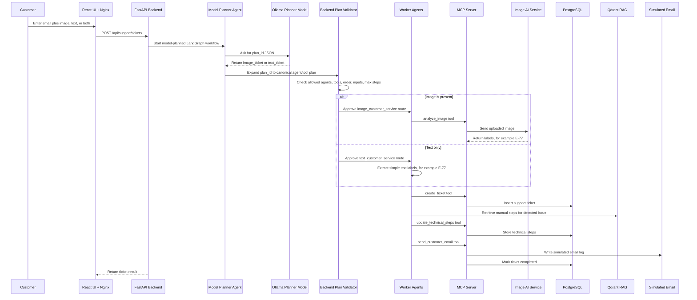
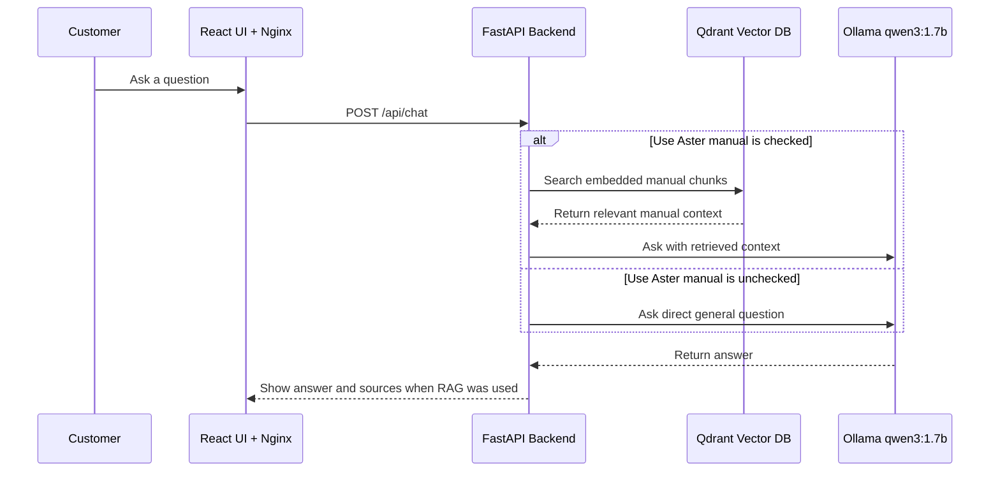
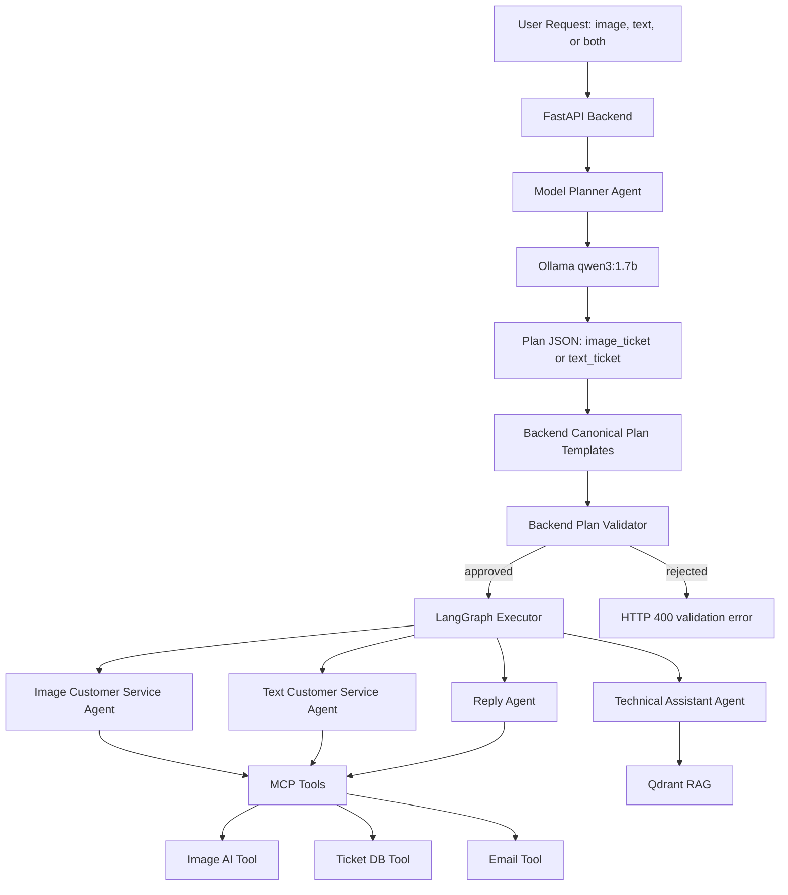
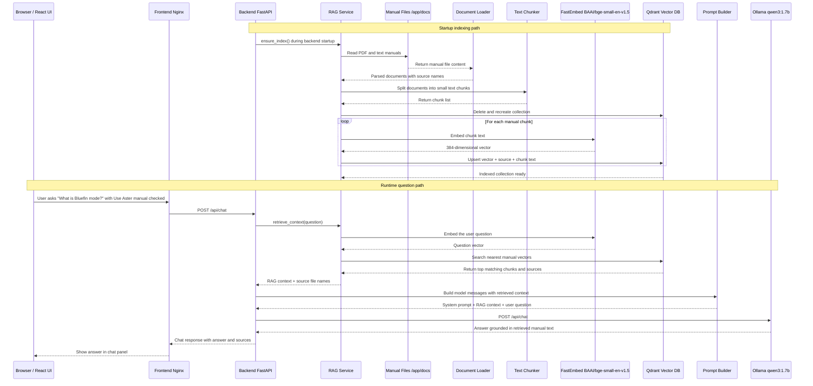
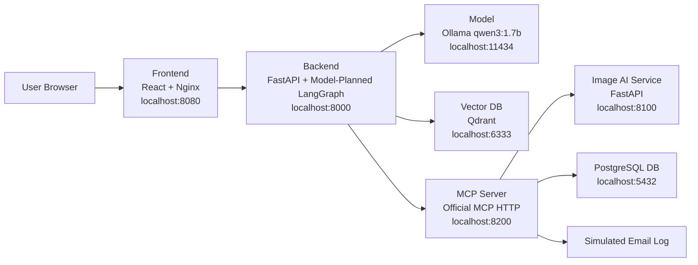

# Aster Pump Aftercare

Local Docker Desktop proof of concept for an after-purchase support system.

The system demonstrates:

- simple customer support UI
- chat UI for manual questions and general questions
- FastAPI backend
- LangGraph model-planned agent orchestration
- official MCP protocol tool server
- local CPU-only LLM through Ollama
- RAG with Qdrant
- PostgreSQL ticket storage
- small Image AI service

## Business Use Cases

Aster Pump Aftercare is a fictional after-purchase support desk for the
`AsterPump X17` product. The PoC demonstrates two customer journeys.

### Use Case 1: Open A Support Ticket

A customer has a visible error on the pump display or a written description of
the issue. The customer enters an email address and can provide an image, text,
or both.

Business outcome:

- the model planner chooses an approved plan id
- the backend expands, validates, and executes that plan
- the system detects product/error information from the image, text, or both
- a support ticket is created in the database
- technical troubleshooting steps are selected from the product manual
- a reply is prepared and marked as sent by the email tool
- the customer can check the latest ticket status from the UI

Component flow:



The backend uses a model planner, backend validator, and worker agents for this
journey:

- Model Planner Agent: asks the local model to choose `image_ticket` or
  `text_ticket`.
- Plan Validator Agent: checks the model plan against allowed agents, allowed
  tools, required order, request inputs, and maximum step limits.
- Image Customer Service Agent: analyzes the image through MCP and opens the
  ticket.
- Text Customer Service Agent: skips image analysis, extracts simple text
  signals, and opens the ticket.
- Technical Assistant Agent: searches the manual through RAG and writes steps.
- Reply Agent: prepares the customer response and calls the email tool.

### Use Case 2: Ask The Model

A customer or support user can ask questions without opening a ticket. This is
useful for quick product-help questions or general model questions.

Business outcome:

- when **Use Aster manual** is checked, the answer is grounded in the local
  Aster Pump manual through RAG
- when **Use Aster manual** is unchecked, the backend asks the local model
  directly for a general answer
- no ticket is created for chat-only questions

Component flow:



Examples:

- Manual/RAG question: `What is Bluefin mode?`
- General model question: `Where is Egypt?`

## Model-Planned Workflow

The support-ticket workflow uses two levels:

1. Model decides the plan.
2. Backend validates and executes the plan.

The model is never allowed to directly execute tools or create arbitrary code.
It only chooses a JSON `plan_id`. The backend expands that id into a canonical
agent/tool plan, validates it against a whitelist, and then LangGraph runs known
nodes.



Example model decision:

```json
{
  "intent": "open_ticket",
  "plan_id": "image_ticket",
  "reason": "The request includes an image, so image analysis is needed."
}
```

Example backend-expanded plan:

```json
{
  "intent": "open_ticket",
  "reason": "The request includes an image, so image intake is required.",
  "steps": [
    {
      "agent": "image_customer_service",
      "tools": ["analyze_image", "create_ticket"]
    },
    {
      "agent": "technical_assistant",
      "tools": ["rag_search", "update_technical_steps"]
    },
    {
      "agent": "reply_agent",
      "tools": ["send_customer_email"]
    }
  ]
}
```

Backend validation checks:

- selected agents are whitelisted
- selected tools are whitelisted for each agent
- image requests start with `image_customer_service`
- text-only requests start with `text_customer_service`
- all support tickets continue through `technical_assistant` and `reply_agent`
- planned step count does not exceed the configured workflow limit

## Detailed RAG Flow

RAG means Retrieval Augmented Generation. In this PoC, the model does not know
the fictional Aster Pump manual from training. The backend reads local manual
files, embeds their text, stores the vectors in Qdrant, retrieves matching
manual chunks at question time, and gives those chunks to the local model as
context.

Manual source files live in:

```text
aster-pump-aftercare-backend/docs
```

Those files include the PDF manual and supporting text manuals. The backend
indexes them when the backend container starts.



If **Use Aster manual** is unchecked, the runtime path skips `RagService`,
`FastEmbed`, and `Qdrant`. The backend sends the question directly to Ollama.

## System Map



## Repositories In This Workspace

| Folder | Component |
| --- | --- |
| `aster-pump-aftercare-frontend` | React UI served by Nginx |
| `aster-pump-aftercare-backend` | FastAPI, LangGraph, RAG, model client, MCP client |
| `aster-pump-aftercare-model` | Ollama model runtime with `qwen3:1.7b` |
| `aster-pump-aftercare-vectordb` | Qdrant vector database |
| `aster-pump-aftercare-db` | PostgreSQL ticket database |
| `aster-pump-aftercare-image-ai-service` | Small image/text analyzer |
| `aster-pump-aftercare-mcp-server` | Official MCP tool server |

## Main Guides

Start here:

```text
DEPLOYMENT_STEPS.md
```

Then read component-specific guides:

- `aster-pump-aftercare-frontend/README.md`
- `aster-pump-aftercare-backend/README.md`
- `aster-pump-aftercare-model/README.md`
- `aster-pump-aftercare-vectordb/README.md`
- `aster-pump-aftercare-db/README.md`
- `aster-pump-aftercare-image-ai-service/README.md`
- `aster-pump-aftercare-mcp-server/README.md`

Each repo also has:

```text
BUILD_AND_DEPLOY.md
```

## Operational Scripts

Scripts are kept in `bin`.

| Script | Function |
| --- | --- |
| `bin/build-all-images.ps1` | Builds all local Docker images. |
| `bin/deploy-stack.ps1` | Starts the Docker Compose stack. |
| `bin/stop-stack.ps1` | Stops the stack. |
| `bin/generate-user-guide.py` | Regenerates the fictional PDF manual. |
| `bin/generate-error-test-images.py` | Regenerates `E-41`, `E-77`, and `E-93` screen images. |

Script details are documented in:

```text
bin/README.md
```

## Quick Start

```powershell
cd C:\ai-workspace\lama-local-llm\aster-pump
docker volume create aster-pump-aftercare-ollama
docker volume create aster-pump-aftercare-qdrant
docker volume create aster-pump-aftercare-postgres
.\bin\build-all-images.ps1
.\bin\deploy-stack.ps1
```

Open:

```text
http://localhost:8080
```

Useful UI tests:

- With **Use Aster manual** checked, ask `What is Bluefin mode?`
- With **Use Aster manual** unchecked, ask `Where is Egypt?`
- Upload `asterpump_x17_e77_screen.png`, enter text such as `The display shows E-77`, or provide both to test dynamic ticket routing.

## Daily Start And Stop

Use these commands after the images and volumes already exist.

Start the full stack:

```powershell
cd C:\ai-workspace\lama-local-llm\aster-pump
.\bin\deploy-stack.ps1
```

Equivalent Docker command:

```powershell
docker compose up -d
```

Stop the full stack:

```powershell
.\bin\stop-stack.ps1
```

Equivalent Docker command:

```powershell
docker compose down
```

Check running containers:

```powershell
docker compose ps
```

Follow logs:

```powershell
docker compose logs -f
```

Follow the main demo story lines only:

```powershell
docker compose logs -f | Select-String -Pattern "FRONTEND \||BACKEND \||MCP \||IMAGE-AI \||MODEL \|"
```

Stopping the stack removes containers, but keeps the named Docker volumes. That
means the Ollama model files, Qdrant vectors, and PostgreSQL tickets stay on
your machine for the next start.
