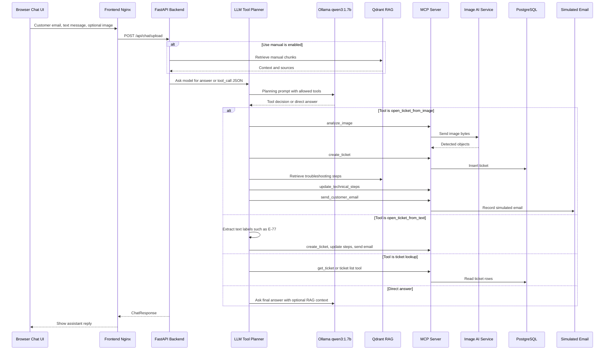
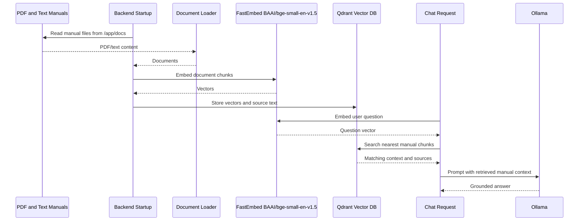
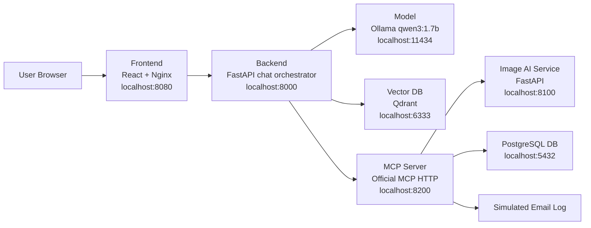

# Aster Pump Aftercare

Local Docker Desktop proof of concept for an after-purchase support assistant.

The user experience is intentionally simple: one chat screen plus one customer
email field at the top of the page. The customer can type a message, optionally
upload an image, optionally enable manual/RAG context, and the backend decides
whether to answer directly or call approved MCP tools.

## Business Use Cases

### Use Case 1: Open A Ticket From Chat

The customer can create a support ticket by typing a request such as:

```text
Create ticket for customer@example.com. The display shows E-77 on my AsterPump X17.
```

The customer can also attach a pump screen image. The email comes from the
page-level email field, so the chat box can stay focused on the actual request.
The LLM planner sees the text, the ticket-related email context, and whether an
image exists. It can request the `open_ticket_from_image` or
`open_ticket_from_text` tool workflow.

Business outcome:

- image text or typed error text is converted into detected objects such as
  `AsterPump X17` and `E-77`
- a ticket is inserted into PostgreSQL through the MCP server
- troubleshooting steps are retrieved from the local PDF manual through RAG
- the ticket is updated with those steps
- a simulated email is sent through the MCP server
- the chat returns the ticket number and status

### Use Case 2: Ask Questions

The same chat can answer:

- RAG/manual questions, for example `What is Bluefin mode?`
- general model questions, for example `Where is Egypt?`
- ticket lookup questions, for example
  `Get me list of my tickets for customer@example.com`
- latest status questions, for example
  `Get latest ticket status for customer@example.com`

When **Use manual** is enabled, the backend searches the embedded AsterPump X17
manual in Qdrant and passes the matching context to Ollama. When it is disabled,
the backend asks the local model without manual context.

## Chat-First Architecture



## Model-Driven Tool Safety

The model decides the plan, but the backend validates and executes the plan.
That gives the demo dynamic behavior without letting the model call arbitrary
tools.

Approved chat tools:

- `open_ticket_from_image`
- `open_ticket_from_text`
- `get_ticket`
- `get_latest_ticket_for_customer`
- `get_tickets_for_customer`

The backend checks:

- the requested tool is in the approved catalog
- required arguments exist, such as customer email or ticket id
- image ticket creation only runs when an image was uploaded
- text ticket creation uses only the chat message text
- raw image bytes are never logged, only image size and content type

The older LangGraph support workflow still exists in the backend for learning
and comparison, but the current UI uses the chat-first LLM-to-MCP route.

## Detailed RAG Flow

Manual source files live in:

```text
aster-pump-aftercare-backend/docs
```

The backend indexes them when the backend container starts.



## System Map



## Repositories In This Workspace

| Folder | Component |
| --- | --- |
| `aster-pump-aftercare-frontend` | React chat UI served by Nginx |
| `aster-pump-aftercare-backend` | FastAPI, RAG, model client, MCP client, and legacy LangGraph training workflow |
| `aster-pump-aftercare-model` | Ollama model runtime with `qwen3:1.7b` |
| `aster-pump-aftercare-vectordb` | Qdrant vector database |
| `aster-pump-aftercare-db` | PostgreSQL ticket database |
| `aster-pump-aftercare-image-ai-service` | Small image/text analyzer |
| `aster-pump-aftercare-mcp-server` | Official MCP tool server |

## Main Guides

Start here:

```text
DEPLOYMENT_STEPS.md
```

For business-flow code tracing with logs, read:

- `BUSINESS_FLOW_00_TRACE_INDEX.md`
- `BUSINESS_FLOW_01_GENERAL_CHAT.md`
- `BUSINESS_FLOW_02_RAG_MANUAL_QUESTION.md`
- `BUSINESS_FLOW_03_TICKET_LOOKUP.md`
- `BUSINESS_FLOW_04_TEXT_TICKET_CREATION.md`
- `BUSINESS_FLOW_05_IMAGE_TICKET_CREATION.md`

Then read component-specific guides:

- `aster-pump-aftercare-frontend/README.md`
- `aster-pump-aftercare-backend/README.md`
- `aster-pump-aftercare-model/README.md`
- `aster-pump-aftercare-vectordb/README.md`
- `aster-pump-aftercare-db/README.md`
- `aster-pump-aftercare-image-ai-service/README.md`
- `aster-pump-aftercare-mcp-server/README.md`

## Quick Start

```powershell
cd C:\ai-workspace\lama-local-llm\aster-pump
.\bin\build-all-images.ps1
.\bin\deploy-stack.ps1
```

Open:

```text
http://localhost:8080
```

Useful UI tests:

- set email to `customer@example.com`, then ask
  `Create ticket. The display shows E-77 on my AsterPump X17.`
- attach `aster-pump-aftercare-backend/docs/assets/test-images/asterpump_x17_e77_screen.png`
  and type `Create ticket for customer@example.com`
- with **Use manual** checked, ask `What is Bluefin mode?`
- with **Use manual** unchecked, ask `Where is Egypt?`
- ask `List my tickets`
- ask `Get latest ticket status`

## Daily Start And Stop

Start:

```powershell
.\bin\deploy-stack.ps1
```

Stop:

```powershell
.\bin\stop-stack.ps1
```

Check containers:

```powershell
docker compose ps
```

Follow logs:

```powershell
docker compose logs -f
```
