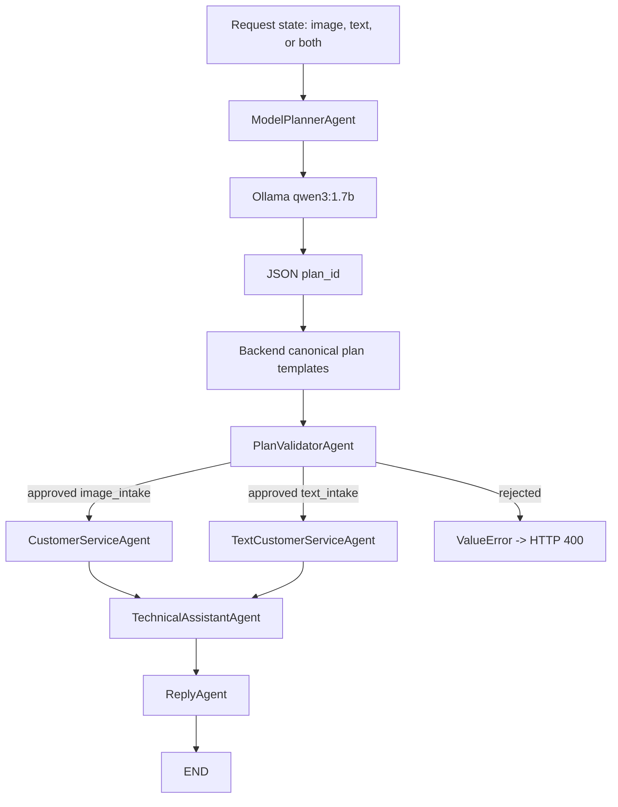

# Agents Package

This package contains the model-planned LangGraph workflow for the aftercare
support-ticket journey.

The design has two levels:

1. The local model decides the plan.
2. The backend validates and executes the plan.

The model never runs tools directly. It only returns JSON. The backend checks
that JSON against strict rules before LangGraph executes known, prebuilt nodes.

## Agent List

| Agent | Runs When | Main Job |
| --- | --- | --- |
| `ModelPlannerAgent` | Always first | Asks Ollama to choose an approved `plan_id`, then expands it to a canonical plan. |
| `PlanValidatorAgent` | After planner | Rejects unsafe or invalid plans before tools run. |
| `CustomerServiceAgent` | Approved image plan | Sends image to MCP image tool, receives detected labels, creates ticket. |
| `TextCustomerServiceAgent` | Approved text plan | Extracts simple text labels, creates ticket without image analysis. |
| `TechnicalAssistantAgent` | After ticket creation | Uses RAG to find manual troubleshooting steps and stores them on the ticket. |
| `ReplyAgent` | Last | Builds the customer reply and calls the MCP email tool. |

## Planning Diagram



## Package Files

| File | Function |
| --- | --- |
| `state.py` | Defines the shared state dictionary used by all graph nodes. |
| `nodes.py` | Contains the planner, validator, and worker agent classes. |
| `workflow.py` | Builds the LangGraph graph and defines dynamic routing. |

## Shared State

Code from `state.py`:

```python
from typing import Any, Literal, TypedDict


class AftercareState(TypedDict, total=False):
    """Shared state passed between planner, validator, and worker agents."""

    customer_email: str
    description: str
    intake_route: Literal["image_intake", "text_intake"]
    model_plan: dict[str, Any]
    planned_steps: list[str]
    planned_tools: list[str]
    plan_reason: str
    planner_source: str
    plan_validation_status: str
    image_filename: str
    image_content_type: str
    image_bytes: bytes
    has_image: bool
    has_text: bool
    workflow_step_count: int
    supervisor_route_count: int
    workflow_trace: list[str]
    detected_objects: list[str]
    detected_error_code: str | None
    ticket_id: int
    technical_steps: str
    reply_subject: str
    reply_body: str
    email_sent: bool
    status: str
```

Explanation:

- `TypedDict` documents the shared state shape.
- `total=False` means not all keys exist at workflow start.
- `model_plan` stores the raw JSON proposed by Ollama.
- `planned_steps` and `planned_tools` store the validated plan.
- `workflow_step_count` and `workflow_trace` are safety/debug fields.
- Worker agents add ticket, RAG, reply, and email fields.

## Safety Guard

Code from `nodes.py`:

```python
def advance_workflow_step(state: AftercareState, node_name: str) -> AftercareState:
    """Increment workflow step counters and stop runaway graphs."""

    step_count = state.get("workflow_step_count", 0) + 1
    if step_count > settings.max_workflow_steps:
        raise ValueError(
            f"Workflow stopped after exceeding max steps "
            f"({settings.max_workflow_steps}). Trace: {state.get('workflow_trace', [])}"
        )

    trace = [*state.get("workflow_trace", []), node_name]
    return {**state, "workflow_step_count": step_count, "workflow_trace": trace}
```

Explanation:

- Every node calls this helper before it does work.
- The helper increments the total workflow step counter.
- It appends the current node name to `workflow_trace`.
- If future model-planned workflows accidentally loop, execution stops.

Normal trace example:

```text
["model_planner", "plan_validator", "text_customer_service", "technical_assistant", "reply_agent"]
```

## Allowed Agents And Tools

Code from `nodes.py`:

```python
ALLOWED_AGENT_TOOLS = {
    "image_customer_service": {"analyze_image", "create_ticket"},
    "text_customer_service": {"create_ticket"},
    "technical_assistant": {"rag_search", "update_technical_steps"},
    "reply_agent": {"send_customer_email"},
}
```

Explanation:

- This is the backend whitelist.
- If the model invents `delete_database`, validation rejects it.
- If the model uses a real tool with the wrong agent, validation rejects it.
- This keeps the model useful but not in control of security.

## Model Planner Agent

Code from `nodes.py`:

```python
class ModelPlannerAgent:
    """Uses the local model to propose a workflow plan as JSON."""

    async def __call__(self, state: AftercareState) -> AftercareState:
        state = advance_workflow_step(state, "model_planner")
        description = state.get("description", "").strip()
        has_image = bool(state.get("image_bytes"))
        has_text = bool(description)

        if not has_image and not has_text:
            raise ValueError("Request must include an image, text description, or both.")

        plan = await self.request_model_plan(
            description=description,
            has_image=has_image,
            has_text=has_text,
        )
        return {
            **state,
            "model_plan": plan,
            "planner_source": "ollama",
            "has_image": has_image,
            "has_text": has_text,
            "status": "planned",
        }
```

Explanation:

- The planner checks whether the request has image bytes or text.
- Empty requests are rejected before calling the model.
- `request_model_plan(...)` asks Ollama to choose an approved `plan_id`.
- The selected plan is normalized into a full executable plan and stored in
  `model_plan`.
- The planner does not call MCP tools or create tickets.

Planner prompt code:

```python
messages = [
    {
        "role": "system",
        "content": (
            "You are a workflow planner for an aftercare support system. "
            "Return JSON only. Do not use markdown. "
            "Your job is to choose exactly one approved plan_id from the backend catalog. "
            "Do not invent plan ids, agents, or tools. "
            "Return only this shape: "
            "{\"intent\":\"open_ticket\",\"plan_id\":\"image_ticket or text_ticket\",\"reason\":\"short reason\"}."
        ),
    },
    {
        "role": "user",
        "content": json.dumps(
            {
                "task": "Create a workflow plan for opening one aftercare ticket.",
                "has_image": has_image,
                "has_text": has_text,
                "description": description,
                "valid_plan_ids": {
                    "image_ticket": "Use when the request includes an image...",
                    "text_ticket": "Use when the request has text and no image...",
                },
                "selected_plan_id_to_return": selected_plan_id,
            }
        ),
    },
]
```

Explanation:

- The system message tells the model to choose a plan id, not to execute tools.
- The user message sends facts about the current request.
- `valid_plan_ids` is the approved backend catalog.
- `selected_plan_id_to_return` makes the tiny local model's job very small.
- The backend still validates the chosen plan after expansion.

Ollama request code:

```python
model_request = {
    "model": settings.model_name,
    "stream": False,
    "think": False,
    "format": "json",
    "options": {
        "temperature": 0,
        "num_predict": 256,
        "num_ctx": 2048,
    },
    "messages": messages,
}
```

Explanation:

- `format: "json"` asks Ollama to produce JSON.
- `temperature: 0` makes planning more stable.
- `think: False` keeps the tiny local model from returning reasoning text.

Example model output for image-plus-text:

```json
{
  "intent": "open_ticket",
  "plan_id": "image_ticket",
  "reason": "The request includes an image, so image analysis is needed."
}
```

Example model output for text-only:

```json
{
  "intent": "open_ticket",
  "plan_id": "text_ticket",
  "reason": "The request has text but no image, so text intake is enough."
}
```

## Plan Normalization

The tiny CPU model is used for the decision, but the backend owns the executable
workflow definition. That is why the model can return a short `plan_id`, then
the backend expands it into exact agents and tools.

Code from `nodes.py`:

```python
def normalize_model_plan(self, parsed: dict[str, Any], has_image: bool) -> dict[str, Any]:
    """Convert a model-selected plan id into a canonical backend plan."""

    plan_id = parsed.get("plan_id") or parsed.get("selected_plan_id_to_return")
    if plan_id not in {"image_ticket", "text_ticket"} and parsed.get("intent") == "open_ticket":
        plan_id = "image_ticket" if has_image else "text_ticket"

    if plan_id not in {"image_ticket", "text_ticket"}:
        raise ValueError(f"Planner model returned unsupported plan_id: {plan_id}")

    expected_plan_id = "image_ticket" if has_image else "text_ticket"
    if plan_id != expected_plan_id:
        raise ValueError(f"Planner model selected {plan_id}, expected {expected_plan_id}.")

    return self.canonical_plan(plan_id=plan_id, reason=str(parsed.get("reason", "")))
```

Explanation:

- The model decides between `image_ticket` and `text_ticket`.
- The backend rejects unknown plan ids.
- The backend rejects a plan id that conflicts with the request input. For
  example, an image upload cannot use `text_ticket`.
- `canonical_plan(...)` returns the exact executable steps used by LangGraph.

Canonical image plan after expansion:

```json
{
  "intent": "open_ticket",
  "reason": "The request includes an image, so image analysis is needed.",
  "steps": [
    {
      "agent": "image_customer_service",
      "tools": ["analyze_image", "create_ticket"]
    },
    {
      "agent": "technical_assistant",
      "tools": ["rag_search", "update_technical_steps"]
    },
    {
      "agent": "reply_agent",
      "tools": ["send_customer_email"]
    }
  ]
}
```

Canonical text plan after expansion:

```json
{
  "intent": "open_ticket",
  "reason": "The request has text but no image, so text intake is enough.",
  "steps": [
    {
      "agent": "text_customer_service",
      "tools": ["create_ticket"]
    },
    {
      "agent": "technical_assistant",
      "tools": ["rag_search", "update_technical_steps"]
    },
    {
      "agent": "reply_agent",
      "tools": ["send_customer_email"]
    }
  ]
}
```

## Plan Validator Agent

The validator is the safety boundary between model output and tool execution.

Code from `nodes.py`:

```python
class PlanValidatorAgent:
    """Validates the model-generated plan before any worker agent runs."""

    def __call__(self, state: AftercareState) -> AftercareState:
        state = advance_workflow_step(state, "plan_validator")
        route_count = state.get("supervisor_route_count", 0) + 1
        if route_count > settings.max_supervisor_routes:
            raise ValueError(
                f"Plan validator stopped after exceeding max route decisions "
                f"({settings.max_supervisor_routes})."
            )
```

Explanation:

- The validator counts route decisions.
- The old field name `supervisor_route_count` is still used as a generic route
  decision counter.
- If a future graph loops back to planning too many times, validation stops it.

Step validation code:

```python
for step in steps:
    agent = step.get("agent")
    tools = step.get("tools", [])
    if not isinstance(agent, str) or agent not in ALLOWED_AGENT_TOOLS:
        raise ValueError(f"Planner selected unsupported agent: {agent}")
    unsupported_tools = set(tools) - ALLOWED_AGENT_TOOLS[agent]
    if unsupported_tools:
        raise ValueError(f"Planner selected unsupported tools for {agent}: {sorted(unsupported_tools)}")
    planned_steps.append(agent)
    planned_tools.extend(tools)
```

Explanation:

- Each step must name one allowed agent.
- Each tool must be allowed for that specific agent.
- Validated agent names are collected in `planned_steps`.
- Validated tool names are collected in `planned_tools`.

Order validation code:

```python
required_first_agent = "image_customer_service" if state.get("has_image") else "text_customer_service"
required_steps = [required_first_agent, "technical_assistant", "reply_agent"]
if planned_steps != required_steps:
    raise ValueError(f"Planner selected invalid step order: {planned_steps}. Expected: {required_steps}")
```

Explanation:

- If the request has an image, the first worker must be
  `image_customer_service`.
- If the request has no image, the first worker must be
  `text_customer_service`.
- Every ticket must continue through technical assistance and reply.
- The model cannot skip email, skip RAG, or run tools out of order.

Approved state code:

```python
route = "image_intake" if required_first_agent == "image_customer_service" else "text_intake"
return {
    **state,
    "intake_route": route,
    "supervisor_route_count": route_count,
    "planned_steps": planned_steps,
    "planned_tools": planned_tools,
    "plan_reason": str(plan.get("reason", "")) if isinstance(plan, dict) else "",
    "plan_validation_status": "approved",
    "status": "routed",
}
```

Explanation:

- `intake_route` is what LangGraph uses for conditional routing.
- `planned_steps` and `planned_tools` are kept for logging/debugging.
- Only an approved plan can reach worker agents.

## Worker Agents

### Image Customer Service Agent

Runs when the approved plan starts with `image_customer_service`.

```python
detected_objects = await self.mcp_client.analyze_image(
    state["image_filename"],
    state["image_bytes"],
    state.get("image_content_type"),
)
```

Explanation:

- The agent sends the uploaded image through MCP.
- MCP calls the Image AI service.
- The result is a list such as `["AsterPump X17", "E-77"]`.

```python
ticket = await self.mcp_client.create_ticket(
    customer_email=state["customer_email"],
    description=state.get("description", ""),
    detected_objects=detected_objects,
)
```

Explanation:

- The ticket is created through MCP.
- The backend never writes directly to PostgreSQL.

### Text Customer Service Agent

Runs when the approved plan starts with `text_customer_service`.

```python
ERROR_PATTERN = re.compile(r"E-?(\d{2,3})(?!\d)", re.IGNORECASE)
```

Explanation:

- This pattern extracts simple error codes such as `E-77`, `E77`, or `e93`.
- It is intentionally deterministic for the PoC.

```python
return objects or ["text_request"]
```

Explanation:

- Even if no product/error code is found, the ticket can still be created.
- The generic `text_request` label tells later agents this was a text-only
  intake.

### Technical Assistant Agent

```python
question = (
    f"Provide after-purchase troubleshooting steps for {issue_terms}. "
    f"Customer description: {state.get('description', '')}"
)
rag_result = rag_service.retrieve_for_question(question)
```

Explanation:

- The agent creates a RAG search query from detected labels and customer text.
- Qdrant returns matching manual chunks.

```python
await self.mcp_client.update_technical_steps(state["ticket_id"], technical_steps)
```

Explanation:

- The generated troubleshooting steps are stored through MCP.

### Reply Agent

```python
subject = f"Support ticket #{state['ticket_id']} troubleshooting steps"
body = (
    f"Hello,\n\n"
    f"We created ticket #{state['ticket_id']} for your product issue.\n\n"
    f"Detected from your request: {', '.join(state.get('detected_objects', []))}\n\n"
    f"{state['technical_steps']}\n\n"
    "Regards,\nAftercare Support"
)
```

Explanation:

- The reply uses the neutral phrase "request" because the input may be image,
  text, or both.

```python
email_sent = await self.mcp_client.send_customer_email(
    ticket_id=state["ticket_id"],
    to=state["customer_email"],
    subject=subject,
    body=body,
)
```

Explanation:

- Email is sent through MCP.
- In this PoC, email is simulated and the ticket is marked completed.

## LangGraph Workflow Wiring

Code from `workflow.py`:

```python
graph = StateGraph(AftercareState)
graph.add_node("model_planner", ModelPlannerAgent())
graph.add_node("plan_validator", PlanValidatorAgent())
graph.add_node("image_customer_service", CustomerServiceAgent(self.mcp_client))
graph.add_node("text_customer_service", TextCustomerServiceAgent(self.mcp_client))
graph.add_node("technical_assistant", TechnicalAssistantAgent(self.mcp_client))
graph.add_node("reply_agent", ReplyAgent(self.mcp_client))
```

Explanation:

- The planner and validator are graph nodes.
- Worker agents are also graph nodes.
- All nodes share the same `AftercareState`.

```python
graph.set_entry_point("model_planner")
graph.add_edge("model_planner", "plan_validator")
```

Explanation:

- The workflow always starts by asking the model for a plan.
- The raw plan always goes through backend validation before execution.

```python
graph.add_conditional_edges(
    "plan_validator",
    self.route_after_plan_validator,
    {
        "image_intake": "image_customer_service",
        "text_intake": "text_customer_service",
    },
)
```

Explanation:

- After validation, LangGraph checks `intake_route`.
- `image_intake` runs image intake.
- `text_intake` runs text intake.

```python
def route_after_plan_validator(self, state: AftercareState) -> str:
    """Return the next node key approved by the plan validator."""

    return state["intake_route"]
```

Explanation:

- The validator wrote `intake_route`.
- This function gives that route to LangGraph.

```python
graph.add_edge("image_customer_service", "technical_assistant")
graph.add_edge("text_customer_service", "technical_assistant")
graph.add_edge("technical_assistant", "reply_agent")
graph.add_edge("reply_agent", END)
```

Explanation:

- Both approved intake paths join at the technical assistant.
- The reply agent is the last node.
- `END` stops the workflow.

## Running The Graph

```python
final_state = await self.graph.ainvoke(
    {
        "customer_email": customer_email,
        "description": description,
        "image_filename": image_filename,
        "image_content_type": image_content_type,
        "image_bytes": image_bytes,
        "workflow_step_count": 0,
        "supervisor_route_count": 0,
        "workflow_trace": [],
    }
)
```

Explanation:

- The API provides the initial state.
- The planner adds `model_plan`.
- The validator adds `planned_steps`, `planned_tools`, and `intake_route`.
- Worker agents add ticket and reply data.
- The final state becomes the API response source.

## Reading Logs

Useful log lines:

```text
BACKEND | INFO | agent.model_planner | proposed plan intent=open_ticket steps=['text_customer_service', 'technical_assistant', 'reply_agent']
BACKEND | INFO | agent.plan_validator | approved route=text_intake steps=['text_customer_service', 'technical_assistant', 'reply_agent']
BACKEND | INFO | workflow | finished ticket_id=25 status=completed steps=5 trace=['model_planner', 'plan_validator', 'text_customer_service', 'technical_assistant', 'reply_agent']
```

These prove:

- the model proposed a plan
- the backend validated the plan
- LangGraph executed only the approved route
